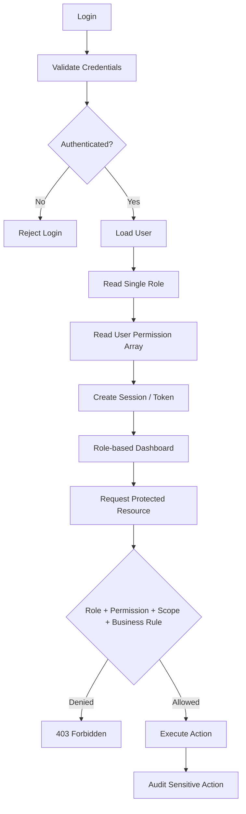
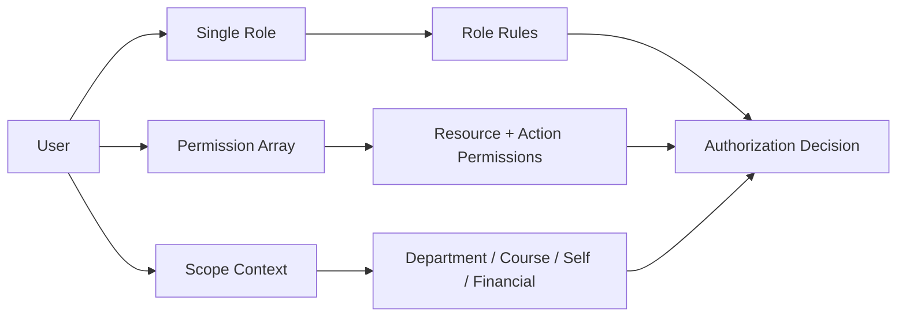
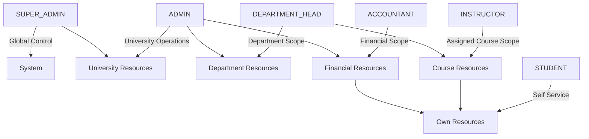
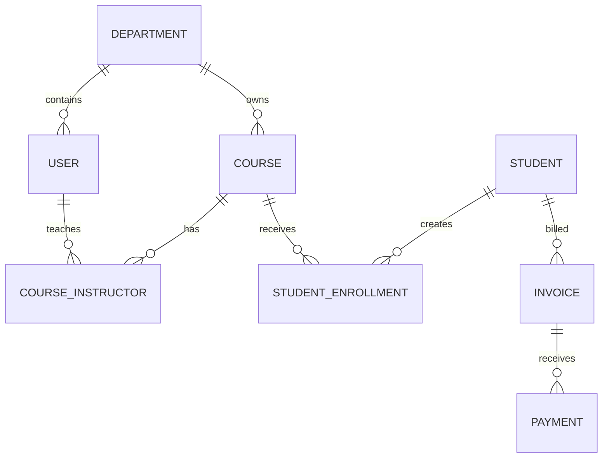

# University Management System — Role Structure & RBAC Design

> **Status:** Production-oriented reference architecture  
> **Primary Roles:** `SUPER_ADMIN`, `ADMIN`, `DEPARTMENT_HEAD`, `INSTRUCTOR`, `STUDENT`, `ACCOUNTANT`  
> **Authorization model:** Single-role RBAC + per-user resource permissions + scoped authorization (University / Department / Course / Self / Financial)  
> **Security principles:** Least Privilege, Separation of Duties, Deny by Default, Backend Enforcement

---

## 0. Design Assumptions

This document treats the six requested roles as **single primary business roles**. Every user has **exactly one role**.

The authorization model follows these rules:

- A `User` stores one `role` field directly.
- A `User` also stores a `permissions Permission[]` array directly.
- A user can never hold multiple roles at the same time.
- `SUPER_ADMIN` owns resource-permission governance for `ADMIN` users.
- `SUPER_ADMIN` can add, remove, or replace an `ADMIN` user's resource permissions.
- `ADMIN` can create another `ADMIN`, but the new admin receives the predefined **default admin permission set** only.
- An `ADMIN` cannot grant, remove, or modify another admin's resource permissions unless a future business rule explicitly allows it. By default, only `SUPER_ADMIN` can do this.
- Non-admin roles use their role-specific default permission set together with data-scope checks. Their authorization should not be treated as unrestricted simply because a permission exists in the user's permission array.
- Role hierarchy and data scope remain different concepts.
- `ACCOUNTANT` is a **parallel functional role**, not a subordinate academic authority.
- Academic authority and financial authority remain separated.
- `DEPARTMENT_HEAD` controls only the department explicitly assigned to them.
- `INSTRUCTOR` controls only resources for courses to which they are assigned.
- `STUDENT` is self-service and can access only their own private academic/financial information.
- `SUPER_ADMIN` has system-level authority, but sensitive actions should still be auditable and, where practical, require step-up authentication.

### Core Authorization Rule

```text
User
 ├── role: Role
 └── permissions: Permission[]

Authorization =
    Role Rule
    + Required Resource Permission
    + Data Scope
    + Business Rule
```

> **Important:** The exact business rules for admissions, registrar functions, examination controllers, scholarship committees, and payment gateways are institution-specific. They are represented here through the six requested roles and can later be extended without introducing multi-role users.

---

# 1. Role Hierarchy

## 1.1 Recommended Logical Hierarchy

The recommended hierarchy is:

```text
                         SUPER_ADMIN
                              │
                 ┌────────────┴────────────┐
                 │                         │
               ADMIN                  ACCOUNTANT
                 │
        ┌────────┴─────────┐
        │                  │
DEPARTMENT_HEAD        University-wide
        │              administrative
        │                 operations
        │
   INSTRUCTOR
        │
     STUDENT
```

### Why `ACCOUNTANT` is parallel

`ACCOUNTANT` should **not** sit under `DEPARTMENT_HEAD` or `INSTRUCTOR`.

Financial operations must be separated from academic authority:

```text
Academic Authority:
SUPER_ADMIN → ADMIN → DEPARTMENT_HEAD → INSTRUCTOR → STUDENT

Financial Authority:
SUPER_ADMIN → ADMIN
                  └── ACCOUNTANT
```

`ADMIN` may coordinate university operations, while `ACCOUNTANT` owns day-to-day financial processing. An accountant must not gain academic write permissions merely because they have financial authority.

## 1.2 Authority Levels

| Role | Authority Level | Primary Scope | Manages |
|---|---:|---|---|
| `SUPER_ADMIN` | 6 | Global | System admins, configuration, security |
| `ADMIN` | 5 | University-wide administrative | Operational users/resources |
| `DEPARTMENT_HEAD` | 4 | Department | Instructors, department academics |
| `INSTRUCTOR` | 3 | Assigned course | Course students, attendance, assessments |
| `ACCOUNTANT` | 3* | Financial | Payments, invoices, financial records |
| `STUDENT` | 1 | Self | Own profile and self-service |

`ACCOUNTANT` has a separate functional authority level; it should not be numerically interpreted as lower than `INSTRUCTOR`.

## 1.3 Override and Permission Governance Rule

Use explicit administrative authority rather than implicit permission inheritance:

```text
SUPER_ADMIN
  ├─ has system-wide authority
  ├─ manages ADMIN resource permissions
  └─ may create ADMIN with custom or default permissions

ADMIN
  ├─ uses only permissions present in its own Permission[] array
  ├─ may create another ADMIN
  ├─ newly created ADMIN receives DEFAULT_ADMIN_PERMISSIONS
  └─ may NOT grant/revoke ADMIN permissions

DEPARTMENT_HEAD
  └─ uses role-defined permissions within own department only

INSTRUCTOR
  └─ uses role-defined permissions within assigned courses only

ACCOUNTANT
  └─ uses role-defined financial permissions only

STUDENT
  └─ uses role-defined self-service permissions only
```

### Important Rule

A higher business role does not automatically inherit every lower-role operation. Authorization must still evaluate the required permission, resource scope, and workflow state.

---

# 2. Role-by-Role Analysis

## 2.1 `SUPER_ADMIN`

### Purpose

System owner/operator with global authority over UMS configuration, security, administration, audit, and role/permission governance.

### Scope

- Global / entire university
- System configuration
- Security
- RBAC
- Audit
- Administrative governance

### Responsibilities

- Manage `ADMIN` accounts.
- Configure system-wide settings.
- Manage role policy and `ADMIN` resource permissions.
- Configure security policies.
- Review audit logs.
- Manage critical integrations.
- Maintain university-wide master data.
- Resolve exceptional administrative cases.
- Protect privileged access.

### Permissions

**Users**
- Full lifecycle management, subject to audit.
- Create/manage admins.
- Suspend/restore accounts.
- Assign or change a user's single role according to role-management policy.
- Grant, revoke, or replace resource permissions for `ADMIN` users.

**Academic**
- Full management of departments, programs, courses, subjects, sessions, semesters, schedules and academic records.

**Finance**
- Full oversight of payments, invoices, scholarships and financial reports.
- Should not routinely perform day-to-day accounting if Separation of Duties is required.

**Security**
- Manage `ADMIN` resource permissions and privileged authorization policy.
- Read audit logs.
- Configure authentication/security policies.

### Restrictions

Even `SUPER_ADMIN` should not:
- silently delete audit evidence;
- modify audit logs directly;
- bypass logging;
- share credentials;
- perform sensitive production actions without traceability.

Recommended controls:
- MFA.
- Short privileged sessions.
- Step-up authentication for critical actions.
- Immutable/append-only audit logs.
- Optional dual approval for destructive or high-risk actions.

---

## 2.2 `ADMIN`

### Purpose

University-wide operational administrator responsible for day-to-day administration.

### Scope

- University-wide administrative scope.
- Academic and user operations where explicitly permitted.
- No system-level RBAC/security ownership.

### Responsibilities

- Manage students, instructors and operational users.
- Create another `ADMIN` using the system-defined default admin permission set.
- Coordinate departments.
- Manage academic master data.
- Manage courses/programs/sessions/semesters.
- Publish notices and events.
- Coordinate enrollment operations.
- Review operational reports.
- Support financial administration without owning privileged system configuration.

### Permissions

- Manage users except privileged `SUPER_ADMIN`, subject to the current admin's own permissions.
- Create another `ADMIN`; the created admin receives `DEFAULT_ADMIN_PERMISSIONS`.
- Manage students/instructors.
- Manage departments and academic structures.
- Manage courses and schedules.
- Review enrollment.
- Publish university notices/events.
- View financial information as required by policy.
- Generate operational reports.
- Coordinate payment-related administrative issues.

### Restrictions

- Cannot create/modify/delete `SUPER_ADMIN`.
- Cannot grant, revoke, or edit another `ADMIN` user's resource permissions.
- Cannot assign custom permissions while creating another `ADMIN`; the default admin permission set must be used.
- Cannot change security-critical system settings reserved for `SUPER_ADMIN`.
- Cannot directly modify audit logs.
- Cannot modify academic grades on behalf of an instructor unless an explicitly defined exceptional workflow exists.
- Should not approve their own high-risk actions.
- Should not perform accounting verification if they initiated the financial transaction.

---

## 2.3 `DEPARTMENT_HEAD`

### Purpose

Academic and operational leader of an assigned department.

### Scope

- Own department(s) only.
- Department instructors.
- Department courses/subjects.
- Department students and academic reports.
- No global system administration.

### Responsibilities

- Manage department instructors.
- Coordinate course offerings.
- Assign instructors to courses where policy allows.
- Review schedules.
- Monitor attendance/academic performance.
- Review instructor-submitted results.
- Approve/reject department-level academic submissions.
- Produce department reports.
- Coordinate departmental notices.

### Permissions

- Read/write department data.
- Read department students.
- Manage department course assignments.
- Review and approve results.
- Generate department reports.
- Recommend or initiate instructor assignments.

### Restrictions

- Cannot modify another department.
- Cannot manage `ADMIN` or `SUPER_ADMIN`.
- Cannot change global system settings.
- Cannot manage financial configuration.
- Cannot change payment records.
- Cannot directly edit an instructor's submitted grade without a controlled correction workflow.
- Cannot access unrelated students' private data.

---

## 2.4 `INSTRUCTOR`

### Purpose

Deliver teaching and manage academic activities for assigned courses.

### Scope

- Assigned course(s).
- Students enrolled in assigned course(s).
- Course-level attendance and assessments.

### Responsibilities

- View assigned course rosters.
- Record attendance.
- Create/manage assignments.
- Create/manage exams.
- Grade assessments.
- Submit final results.
- Communicate with enrolled students.
- Review course performance.

### Permissions

- Read assigned courses.
- Read enrolled students for assigned courses.
- Create/update attendance.
- Create/update assignments.
- Create/update exams.
- Enter grades.
- Submit results for review.
- View course reports.
- Publish course materials where supported.

### Restrictions

- Cannot manage another instructor's course unless explicitly assigned.
- Cannot change department structure.
- Cannot assign themselves to courses.
- Cannot approve their own final results.
- Cannot modify financial records.
- Cannot view unrelated student private information.
- Cannot modify another instructor's grades.
- Cannot directly publish final results if department approval is required.

---

## 2.5 `STUDENT`

### Purpose

Self-service access to academic, profile, enrollment and financial information.

### Scope

- Own account.
- Own academic records.
- Own enrollments.
- Own attendance.
- Own invoices/payments.
- Public/university-wide information.

### Responsibilities

- Maintain permitted profile fields.
- Request/enroll in courses.
- View schedule.
- Submit assignments.
- View attendance.
- View exam/result information.
- View invoices and payment history.
- Make payments through supported payment mechanisms.
- View notices/events.

### Permissions

- Read/update permitted profile fields.
- Read available courses.
- Create enrollment requests.
- Read own enrollment.
- Read own attendance.
- Submit assignments.
- Read own grades/results after publication.
- Read own invoices/payment status.
- Initiate payment.
- Read public notices/events.

### Restrictions

- Cannot read another student's private data.
- Cannot change grades.
- Cannot approve enrollment.
- Cannot edit attendance.
- Cannot modify invoices.
- Cannot verify payments.
- Cannot access financial reports.
- Cannot access audit logs.
- Cannot assign roles.

---

## 2.6 `ACCOUNTANT`

### Purpose

Manage operational financial records while remaining isolated from academic authority.

### Scope

- Financial data required for accounting.
- Student billing/payment records.
- Financial reports.
- Scholarship/payment operations where assigned.

### Responsibilities

- Create/manage invoices.
- Verify payments.
- Record approved financial transactions.
- Reconcile payment records.
- Maintain student financial records.
- Process scholarships/financial adjustments according to policy.
- Generate financial reports.
- Investigate payment discrepancies.

### Permissions

- Read student billing information.
- Create/update invoices.
- Verify payments.
- Record financial transactions.
- Generate financial reports.
- Manage financial adjustments subject to approval rules.
- Read scholarship/payment information.
- Export approved financial reports.

### Restrictions

- Cannot create or modify academic grades.
- Cannot modify attendance.
- Cannot manage courses or instructors.
- Cannot change user roles.
- Cannot change RBAC configuration.
- Cannot directly alter immutable transaction history.
- Cannot approve their own exceptional refund/adjustment.
- Should not have unrestricted access to unrelated student academic/private data.

---

# 3. Detailed Permission Matrix

## Legend

- **F** = Full access within role's scope
- **M** = Manage (CRUD + relevant business actions)
- **R** = Read
- **O** = Own/self only
- **D** = Department scope
- **C** = Assigned course scope
- **FIN** = Financial scope
- **A** = Approve/review
- **P** = Publish
- **—** = No access

The matrix describes the **default business capability** for each role. Every request must additionally pass the applicable scope check.

For `ADMIN`, the matrix is only an upper-level role capability reference. The actual action is allowed only when the required resource permission is also present in that admin user's `permissions Permission[]` array. `SUPER_ADMIN` controls that admin permission array.

| Resource | SUPER_ADMIN | ADMIN | DEPARTMENT_HEAD | INSTRUCTOR | STUDENT | ACCOUNTANT |
|---|---|---|---|---|---|---|
| Users | F | M | D/R | O | O | Limited R |
| Students | F | M | D/M | C/R | O | FIN/R |
| Instructors | F | M | D/M | O/R | R (basic/public) | — |
| Departments | F | M | D/R | R | R | R |
| Courses | F | M | D/M | C/M | R | R |
| Subjects | F | M | D/M | C/R | R | R |
| Programs | F | M | D/R | R | R | — |
| Academic Sessions | F | M | D/R | R | R | R |
| Semesters | F | M | D/R | R | R | R |
| Class Schedules | F | M | D/M | C/M | O/R | R |
| Enrollments | F | M/A | D/A | C/R | O/Create Request | FIN-related R |
| Attendance | F | M/Override* | D/R/A | C/M | O/R | — |
| Assignments | F | M | D/R | C/M | C/Submit | — |
| Exams | F | M | D/R/A | C/M | C/R | — |
| Results | F | M* | D/A | C/Create Draft | O/R after publish | — |
| Grades | F | M* | D/A | C/Create/Update | O/R | — |
| Notices | F/P | M/P | D/P | C/Create* | R | R |
| Events | F/M/P | M/P | D/M/P | C/R | R | R |
| Payments | F/Oversight | R/M* | R (limited) | — | O/Create | FIN/M |
| Invoices | F | R/M* | R (limited) | — | O/R | FIN/M |
| Scholarships | F | M | D/R/Recommend | — | O/Request | FIN/M |
| Financial Reports | F | R/Generate | D/R | — | — | FIN/Generate |
| System Settings | F | Limited | — | — | — | — |
| Audit Logs | F/R | R (operational) | R (department events) | Own action logs | Own security events | Financial events |

`*` = should be controlled by explicit workflow/approval policy rather than unrestricted modification.

---

# 4. CRUD + Granular Action Permissions

CRUD is not sufficient for UMS. Business actions should be modeled separately.

## 4.1 Core Actions

```text
CREATE
READ
UPDATE
DELETE
APPROVE
REJECT
ASSIGN
PUBLISH
ARCHIVE
SUSPEND
RESTORE
EXPORT
GENERATE_REPORT
SUBMIT
VERIFY
RECONCILE
REQUEST
```

## 4.2 Recommended Role Action Profile

| Action | SUPER_ADMIN | ADMIN | DEPARTMENT_HEAD | INSTRUCTOR | STUDENT | ACCOUNTANT |
|---|---:|---:|---:|---:|---:|---:|
| CREATE | ✓ | ✓ | ✓ scoped | ✓ scoped | Limited/self | ✓ financial |
| READ | ✓ | ✓ | ✓ scoped | ✓ scoped | Own/public | ✓ financial |
| UPDATE | ✓ | ✓ | ✓ scoped | ✓ scoped | Own permitted | ✓ financial |
| DELETE | ✓ | Scoped | Limited | Limited | — | Limited |
| APPROVE | ✓ | ✓ | ✓ academic | — | — | ✓ financial |
| REJECT | ✓ | ✓ | ✓ academic | Limited | — | ✓ financial |
| ASSIGN | ✓ | ✓ | ✓ department | — | — | — |
| PUBLISH | ✓ | ✓ | ✓ department | Course-limited | — | Financial reports if authorized |
| ARCHIVE | ✓ | ✓ | Scoped | Course-limited | — | Financial records per policy |
| SUSPEND | ✓ | ✓ users | Scoped recommendation | — | — | — |
| RESTORE | ✓ | ✓ | Scoped | — | — | — |
| EXPORT | ✓ | ✓ | Department | Course | Own permitted | Financial |
| GENERATE_REPORT | ✓ | ✓ | Department | Course | Own | Financial |
| SUBMIT | ✓ | ✓ | ✓ | ✓ | ✓ applicable | ✓ financial |
| VERIFY | ✓ | Limited | — | — | — | ✓ payments |

---

# 5. Role-Specific Workflow Responsibilities

## 5.1 Enrollment

```text
STUDENT
   │
   ├── Select available course
   │
   ├── Submit enrollment request
   ▼
System validates prerequisites / capacity
   │
   ▼
DEPARTMENT_HEAD / ADMIN
   │
   ├── Review
   ├── Approve
   └── Reject
   │
   ▼
Enrollment Confirmed
   │
   ▼
STUDENT + INSTRUCTOR notified
```

### Security rules

- Student can create a request but cannot approve it.
- Department Head can approve within department.
- Admin can handle university-level exceptions.
- Instructor can see enrollment only for assigned courses.
- The backend must validate department/course ownership.

---

## 5.2 Result Submission

```text
INSTRUCTOR
   │
   ├── Select assigned course
   ├── Enter grades
   └── Submit results
   │
   ▼
DEPARTMENT_HEAD
   │
   ├── Review
   ├── Approve ──────────┐
   └── Reject            │
       │                 │
       └── Return ───────┘
                         ▼
                   Publish Result
                         │
                         ▼
                      STUDENT
```

### Security rules

- Instructor can edit a draft.
- Submission creates an auditable state transition.
- Department Head approves/rejects.
- Instructor cannot approve their own result.
- Student can read only after publication.
- Corrections after publication should use a separate correction workflow.

---

## 5.3 Payment

```text
STUDENT
   │
   ├── View invoice
   ├── Initiate payment
   ▼
Payment Gateway / Payment Service
   │
   ▼
Payment received
   │
   ▼
ACCOUNTANT
   │
   ├── Verify / reconcile
   ▼
Payment Confirmed
   │
   ├── Financial record updated
   └── Student notified
```

### Security rules

- Never trust payment amount/status supplied by the client.
- Payment confirmation should use verified gateway/webhook data.
- Accountant cannot alter immutable gateway evidence.
- Refunds/adjustments should use a separate approval workflow.
- Financial operations must be fully audited.

---

# 6. Data Access Scope

RBAC answers **what** a user can do. Scope answers **which records** they can do it to.

Recommended authorization formula:

```text
ALLOW =
    authenticated
    AND role_rule_allows_action
    AND required_permission_exists_in_user.permissions
    AND resource_is_in_scope
    AND business_rules_pass
```

## 6.1 Scope Matrix

| Role | Read Scope | Write Scope | Update Scope | Delete Scope |
|---|---|---|---|---|
| `SUPER_ADMIN` | Entire system | Global resources | Global resources | Only explicitly deletable resources |
| `ADMIN` | University administrative data | University operational data | University operational data | Scoped operational resources |
| `DEPARTMENT_HEAD` | Own department | Own department | Own department | Department resources where permitted |
| `INSTRUCTOR` | Assigned courses/students | Assigned course activities | Assigned course activities | Own drafts/course content |
| `STUDENT` | Own + public | Own permitted self-service actions | Own permitted fields/submissions | Own cancellable requests |
| `ACCOUNTANT` | Financial + minimum required student billing data | Financial resources | Financial resources | Only explicitly deletable financial drafts |

## 6.2 Department Isolation

A Department Head request should be evaluated like:

```text
user.departmentId === resource.departmentId
```

Do not rely only on:

```text
role === "DEPARTMENT_HEAD"
```

## 6.3 Course Isolation

Instructor access should additionally validate assignment:

```text
CourseInstructor.userId === currentUser.id
AND CourseInstructor.courseId === requestedCourseId
```

This prevents:

```text
Instructor A → Course B ❌
Instructor A → Course A ✓
```

## 6.4 Student Isolation

Student access should normally require:

```text
resource.studentId === currentUser.studentId
```

This applies to:
- profile;
- attendance;
- grades;
- results;
- invoices;
- payment history;
- enrollment records.

---

# 7. Privacy and Sensitive Data Rules

Student data should be classified and minimized.

## Suggested classifications

### Public

- Published course catalog
- Public notices
- Public events
- Basic instructor public profile

### Internal

- Course schedules
- Department reports
- Operational data

### Confidential

- Student academic records
- Attendance
- Grades
- Enrollment details
- Payment history

### Restricted

- Authentication credentials
- Security configuration
- RBAC configuration
- Audit/security events
- Sensitive financial controls

### Rules

1. Never return fields that the caller does not need.
2. Do not expose database objects directly through API responses.
3. Use DTOs/serializers.
4. Enforce object-level authorization.
5. Log access to sensitive resources where appropriate.
6. Avoid exposing private student information in URLs, logs, or client-side state unnecessarily.

---

# 8. User Flows

## 8.1 Authentication & Authorization



## 8.2 Permission Relationship



## 8.3 Role Access Relationship



---

# 9. RBAC Architecture Recommendation

## 9.1 Use RBAC + Scope-Based Authorization

Do **not** build authorization as:

```ts
if (user.role === "ADMIN") {
  // allow
}
```

Prefer:

```text
Authentication
      ↓
User Identity
      ↓
Single Role
      ↓
User Permission[]
      ↓
Resource
      ↓
Action
      ↓
Scope
      ↓
Business Rule
      ↓
ALLOW / DENY
```

## 9.2 Permission Naming Convention

Recommended:

```text
<resource>:<action>
```

Examples:

```text
users:read
users:create
users:update
users:suspend

students:read
students:update

courses:create
courses:read
courses:update
courses:assign

attendance:create
attendance:update

assignments:create
assignments:grade

exams:create
exams:update

results:submit
results:approve
results:reject
results:publish

payments:create
payments:read
payments:verify
payments:reconcile

invoices:create
invoices:update

reports:financial
reports:academic

roles:read
roles:manage

audit_logs:read
system_settings:manage
```

## 9.3 User → Permission

Permissions are stored directly on the `User` record:

```text
User
 ├── role
 └── permissions[]
        └── Resource + Action
```

Example admin:

```text
ADMIN
 ├── users:read
 ├── users:create
 ├── students:read
 ├── students:update
 ├── courses:read
 ├── courses:update
 └── notices:publish
```

The presence of `ADMIN` in the `role` field does not automatically grant every admin capability. The backend must check the required permission in `user.permissions`.

## 9.4 Single Role Per User

A user must have exactly one role:

```text
User
  └── role: Role
```

Do not use `UserRole` or any many-to-many user-role table for this design.

Examples:

```text
User A → ADMIN
User B → INSTRUCTOR
User C → STUDENT
```

Invalid:

```text
User A → ADMIN + ACCOUNTANT  ❌
User B → INSTRUCTOR + DEPARTMENT_HEAD  ❌
```

If a person's responsibility changes, update the single `role` value through an authorized role-change workflow instead of attaching a second role.

---

# 10. Recommended Database/RBAC Model

## 10.1 Core Entities

```text
User
Department
Program
Subject
Course
CourseInstructor
Student
Instructor
AcademicSession
Semester
ClassSchedule
StudentEnrollment
Attendance
Assignment
AssignmentSubmission
Exam
Grade
Result
Invoice
Payment
Scholarship
FinancialTransaction
Notice
Event
AuditLog
SystemSetting
```

There is **no `UserRole` join table** and no `RolePermission` join table in this design.

`Role` and `Permission` are represented as Prisma enums and stored directly in `User`:

```text
User
 ├── role: Role
 └── permissions: Permission[]
```

## 10.2 Conceptual Relationship



The `role` and `permissions` fields are attributes of `USER`, not separate many-to-many relationships.

## 10.3 Permission Ownership

### `SUPER_ADMIN`

- Has system-wide privileged authority.
- Can create `ADMIN` accounts.
- Can set an admin's resource permissions.
- Can add or remove permissions from an admin's `Permission[]` array.

### `ADMIN`

- Can only perform actions allowed by its own `Permission[]` array and scope/business rules.
- Can create another `ADMIN` when permitted.
- The new admin must receive the predefined `DEFAULT_ADMIN_PERMISSIONS` set.
- Cannot provide a custom permission array during admin creation.
- Cannot later edit another admin's permissions.

### Other Roles

`DEPARTMENT_HEAD`, `INSTRUCTOR`, `STUDENT`, and `ACCOUNTANT` receive their application-defined default permission arrays. Their data access remains restricted by department, assigned course, self, or financial scope.

## 10.4 Scope Is Still Relational

Permissions answer **what action** is permitted. Domain relationships determine **where** the action is permitted.

Example:

```text
User:
  role = INSTRUCTOR
  permissions = [COURSE_READ, ATTENDANCE_CREATE, RESULT_SUBMIT]

CourseInstructor:
  instructorId → CSE-301
  instructorId → CSE-401
```

Therefore:

```text
RESULT_SUBMIT permission
+ INSTRUCTOR role rule
+ CourseInstructor relation
= submission allowed only for assigned courses
```

---

# 11. Prisma Conceptual Example

The schema should keep the user's single role and all granted permissions directly in the `User` table.

```prisma
enum Role {
  SUPER_ADMIN
  ADMIN
  DEPARTMENT_HEAD
  INSTRUCTOR
  STUDENT
  ACCOUNTANT
}

enum Permission {
  USER_READ
  USER_CREATE
  USER_UPDATE
  USER_SUSPEND
  USER_RESTORE

  STUDENT_READ
  STUDENT_CREATE
  STUDENT_UPDATE

  INSTRUCTOR_READ
  INSTRUCTOR_CREATE
  INSTRUCTOR_UPDATE

  DEPARTMENT_READ
  DEPARTMENT_CREATE
  DEPARTMENT_UPDATE

  COURSE_READ
  COURSE_CREATE
  COURSE_UPDATE
  COURSE_DELETE
  COURSE_ASSIGN_INSTRUCTOR

  SUBJECT_READ
  SUBJECT_CREATE
  SUBJECT_UPDATE

  PROGRAM_READ
  PROGRAM_CREATE
  PROGRAM_UPDATE

  ACADEMIC_SESSION_READ
  ACADEMIC_SESSION_MANAGE
  SEMESTER_READ
  SEMESTER_MANAGE
  CLASS_SCHEDULE_READ
  CLASS_SCHEDULE_MANAGE

  ENROLLMENT_READ
  ENROLLMENT_CREATE
  ENROLLMENT_APPROVE
  ENROLLMENT_REJECT

  ATTENDANCE_READ
  ATTENDANCE_CREATE
  ATTENDANCE_UPDATE

  ASSIGNMENT_READ
  ASSIGNMENT_CREATE
  ASSIGNMENT_UPDATE
  ASSIGNMENT_SUBMIT
  ASSIGNMENT_GRADE

  EXAM_READ
  EXAM_CREATE
  EXAM_UPDATE

  RESULT_READ
  RESULT_CREATE
  RESULT_UPDATE
  RESULT_SUBMIT
  RESULT_APPROVE
  RESULT_REJECT
  RESULT_PUBLISH

  NOTICE_READ
  NOTICE_CREATE
  NOTICE_UPDATE
  NOTICE_PUBLISH

  EVENT_READ
  EVENT_CREATE
  EVENT_UPDATE
  EVENT_PUBLISH

  PAYMENT_READ
  PAYMENT_CREATE
  PAYMENT_VERIFY
  PAYMENT_RECONCILE

  INVOICE_READ
  INVOICE_CREATE
  INVOICE_UPDATE

  SCHOLARSHIP_READ
  SCHOLARSHIP_CREATE
  SCHOLARSHIP_UPDATE
  SCHOLARSHIP_APPROVE

  FINANCIAL_REPORT_READ
  FINANCIAL_REPORT_GENERATE
  FINANCIAL_REPORT_EXPORT

  SYSTEM_SETTING_READ
  SYSTEM_SETTING_MANAGE
  AUDIT_LOG_READ

  ADMIN_PERMISSION_READ
  ADMIN_PERMISSION_UPDATE
}

model User {
  id           String       @id @default(cuid())
  email        String       @unique
  passwordHash String?

  role         Role
  permissions  Permission[]

  isActive     Boolean      @default(true)
  departmentId String?

  department   Department?  @relation(fields: [departmentId], references: [id])

  createdAt    DateTime     @default(now())
  updatedAt    DateTime     @updatedAt
}

model Department {
  id      String @id @default(cuid())
  name    String @unique

  users   User[]
  courses Course[]
}

model CourseInstructor {
  courseId     String
  instructorId String

  @@id([courseId, instructorId])
}
```

## 11.1 Default Permission Sets

Keep default permission sets in trusted backend code or controlled configuration.

Conceptual example:

```ts
const DEFAULT_ADMIN_PERMISSIONS: Permission[] = [
  Permission.USER_READ,
  Permission.USER_CREATE,
  Permission.STUDENT_READ,
  Permission.STUDENT_CREATE,
  Permission.STUDENT_UPDATE,
  Permission.INSTRUCTOR_READ,
  Permission.COURSE_READ,
  Permission.DEPARTMENT_READ,
  Permission.NOTICE_READ,
  Permission.NOTICE_CREATE,
];
```

When an `ADMIN` creates another admin:

```ts
await prisma.user.create({
  data: {
    email,
    role: Role.ADMIN,
    permissions: DEFAULT_ADMIN_PERMISSIONS,
  },
});
```

The request body must **not** be trusted to provide arbitrary admin permissions.

Bad:

```ts
permissions: req.body.permissions
```

Preferred:

```ts
permissions: DEFAULT_ADMIN_PERMISSIONS
```

## 11.2 SUPER_ADMIN Permission Management

Only `SUPER_ADMIN` can customize an admin's resource permissions:

```ts
await prisma.user.update({
  where: { id: adminId },
  data: {
    permissions: updatedAdminPermissions,
  },
});
```

Before updating, verify that the target user's role is `ADMIN` and validate every permission against the set that is permitted to be delegated to admins.

## 11.3 Single-Role Database Rule

Because `role` is a single enum field:

```prisma
role Role
```

the schema naturally prevents a user from holding multiple roles simultaneously.

---

# 12. Backend Authorization Architecture

## 12.1 Recommended Layers

```text
HTTP Request
     ↓
Authentication Middleware
     ↓
User / Session
     ↓
Role Guard
     ↓
Permission Guard (`user.permissions`)
     ↓
Scope Guard
     ↓
Controller / Route Handler
     ↓
Service Layer
     ↓
Repository / Prisma
     ↓
Database
     ↓
Audit Event
```

## 12.2 Authentication ≠ Authorization

Authentication answers:

> Who are you?

Authorization answers:

> Are you allowed to perform this action on this resource?

Never treat a valid JWT as proof that the requested operation is authorized.

## 12.3 Backend Must Be Authoritative

Frontend permission checks are for UX only:

```text
Frontend:
hide "Delete" button
        ↓
Backend:
still MUST reject unauthorized DELETE
```

A malicious user can call the API directly using Postman/curl/browser tools.

---

# 13. API Authorization Examples

## 13.1 Student APIs

```text
GET    /api/students
POST   /api/students
GET    /api/students/:id
PATCH  /api/students/:id
DELETE /api/students/:id
```

Recommended policy:

| Endpoint | SUPER_ADMIN | ADMIN | DEPARTMENT_HEAD | INSTRUCTOR | STUDENT | ACCOUNTANT |
|---|---|---|---|---|---|---|
| `GET /students` | ALLOW | ALLOW | Department | Assigned-course students | DENY | Financial-limited |
| `POST /students` | ALLOW | ALLOW | Limited | DENY | Self-registration workflow | DENY |
| `GET /students/:id` | ALLOW | ALLOW | Own dept | Assigned student | Own only | Billing-only DTO |
| `PATCH /students/:id` | ALLOW | ALLOW | Limited | DENY | Own permitted fields | DENY |
| `DELETE /students/:id` | ALLOW | Scoped | DENY | DENY | DENY | DENY |

## 13.2 Course APIs

```text
GET    /api/courses
POST   /api/courses
PATCH  /api/courses/:id
DELETE /api/courses/:id
POST   /api/courses/:id/instructors
```

Policy:

```text
SUPER_ADMIN       → Full
ADMIN             → University operational scope
DEPARTMENT_HEAD   → Own department
INSTRUCTOR        → Assigned course read / limited update
STUDENT           → Read available courses
ACCOUNTANT        → Read basic course data only
```

## 13.3 Result APIs

```text
POST   /api/courses/:courseId/results
PATCH  /api/results/:id
POST   /api/results/:id/submit
POST   /api/results/:id/approve
POST   /api/results/:id/reject
POST   /api/results/:id/publish
GET    /api/students/:studentId/results
```

Policy:

```text
INSTRUCTOR
    → create/update draft for assigned course
    → submit

DEPARTMENT_HEAD
    → review
    → approve/reject

ADMIN
    → operational oversight / exceptional workflow

SUPER_ADMIN
    → global oversight

STUDENT
    → read own published results

ACCOUNTANT
    → no academic result access by default
```

## 13.4 Payment APIs

```text
GET    /api/invoices
POST   /api/payments
GET    /api/payments/:id
POST   /api/payments/:id/verify
POST   /api/payments/:id/reconcile
```

Policy:

```text
STUDENT
    → own invoice
    → initiate own payment
    → view own payment

ACCOUNTANT
    → financial management
    → verify/reconcile

ADMIN
    → operational oversight where authorized

SUPER_ADMIN
    → global oversight

INSTRUCTOR
    → no access

DEPARTMENT_HEAD
    → limited financial visibility if required
```

---

# 14. Separation of Duties

A production UMS should avoid allowing one person to complete an entire sensitive workflow.

## Recommended control

### Result

```text
INSTRUCTOR
  Submit Result
      ↓
DEPARTMENT_HEAD
  Approve Result
      ↓
System / Authorized Publisher
  Publish
```

### Payment

```text
STUDENT
  Initiate Payment
      ↓
Gateway
  Confirm Transaction
      ↓
ACCOUNTANT
  Verify/Reconcile
```

### Sensitive financial adjustment

```text
ACCOUNTANT
  Create Adjustment Request
      ↓
ADMIN / Authorized Approver
  Approve
      ↓
System
  Apply Adjustment
```

### Privileged role and admin-permission management

```text
SUPER_ADMIN
  ├── Assign / change privileged role
  └── Grant / revoke ADMIN resource permissions
          ↓
       Audit Log
```

```text
ADMIN
  Create another ADMIN
      ↓
System applies DEFAULT_ADMIN_PERMISSIONS
      ↓
Audit Log
```

An admin cannot supply a custom permission list for a newly created admin.

Do not allow ordinary administrators to promote themselves or other users to `SUPER_ADMIN`.

---

# 15. Security Rules

## 15.1 Least Privilege

Grant the smallest permission set needed.

Examples:

```text
ACCOUNTANT:
payments:verify ✓
grades:update   ✗

INSTRUCTOR:
attendance:update ✓
payments:update   ✗

STUDENT:
results:read ✓
results:update ✗
```

## 15.2 Deny by Default

If no permission exists:

```text
DENY
```

Do not implement:

```text
if role is not explicitly denied:
    ALLOW
```

Prefer:

```text
if explicit permission
AND scope matches
AND resource state allows action:
    ALLOW
else:
    DENY
```

## 15.3 Privileged Role Protection

Only `SUPER_ADMIN` should manage privileged role policy and customize `ADMIN` resource permissions by default.

Recommended:
- MFA;
- audit logs;
- rate limiting;
- session expiry;
- re-authentication;
- IP/device controls where appropriate;
- alerting for privileged changes.

## 15.4 Auditability

Log security-sensitive actions such as:

```text
ROLE_ASSIGNED
ROLE_REVOKED
USER_SUSPENDED
USER_RESTORED
PERMISSION_CHANGED
GRADE_SUBMITTED
GRADE_APPROVED
GRADE_REJECTED
RESULT_PUBLISHED
PAYMENT_VERIFIED
PAYMENT_RECONCILED
INVOICE_ADJUSTED
SCHOLARSHIP_APPROVED
SYSTEM_SETTING_CHANGED
```

An audit record should conceptually include:

```text
actorId
action
resourceType
resourceId
timestamp
requestId
ipAddress
userAgent
metadata
result
```

Do not store secrets, passwords, access tokens, or unnecessary sensitive payloads in audit logs.

---

# 16. Frontend Role-Based UI

Frontend authorization should improve usability, not provide security.

Example:

```ts
if (can("results:approve")) {
  showApproveButton();
}
```

But the API must independently enforce:

```text
POST /api/results/:id/approve
```

The frontend may hide:
- navigation items;
- buttons;
- actions;
- dashboards.

The backend must enforce:
- endpoint access;
- object ownership;
- department scope;
- course assignment;
- state transitions;
- business rules.

---

# 17. Recommended Authorization Helper

A conceptual backend API:

```ts
authorize({
  user,
  permission: "results:approve",
  resource: result,
  scope: {
    departmentId: result.departmentId,
  },
});
```

Evaluation:

```text
1. Is the user authenticated?
2. Is the account active?
3. Does the user have the permission?
4. Is the resource in the user's scope?
5. Is the resource in a valid state?
6. Does Separation of Duties permit the action?
7. Is the action audited?
8. Allow or deny.
```

---

# 18. State-Based Authorization

Permission alone is sometimes insufficient.

Example:

```text
DRAFT
  ↓
SUBMITTED
  ↓
APPROVED
  ↓
PUBLISHED
```

Rules:

```text
INSTRUCTOR:
DRAFT → SUBMITTED

DEPARTMENT_HEAD:
SUBMITTED → APPROVED / REJECTED

AUTHORIZED PUBLISHER:
APPROVED → PUBLISHED

STUDENT:
READ PUBLISHED
```

Do not allow:

```text
STUDENT → PUBLISHED
```

or:

```text
INSTRUCTOR → APPROVED
```

unless the business workflow explicitly permits it.

---

# 19. Recommended API Guard Pattern

Conceptual Express-style pattern:

```ts
router.post(
  "/results/:id/approve",
  authenticate,
  requirePermission("results:approve"),
  requireDepartmentScope(),
  requireResultState("SUBMITTED"),
  resultController.approve
);
```

For an instructor:

```ts
router.post(
  "/courses/:courseId/results",
  authenticate,
  requirePermission("results:create"),
  requireCourseInstructorScope(),
  resultController.create
);
```

For students:

```ts
router.get(
  "/students/:studentId/results",
  authenticate,
  requirePermission("results:read"),
  requireSelfOrAuthorizedScope(),
  resultController.get
);
```

---

# 20. Role and Admin-Permission Management Rules

## 20.1 Single Role Assignment Matrix

| Target Role | SUPER_ADMIN | ADMIN | DEPARTMENT_HEAD | INSTRUCTOR | STUDENT | ACCOUNTANT |
|---|---|---|---|---|---|---|
| `SUPER_ADMIN` | ✓ | — | — | — | — | — |
| `ADMIN` | ✓ | ✓ with default permissions | — | — | — | — |
| `DEPARTMENT_HEAD` | ✓ | ✓ if permitted | Scoped recommendation | — | — | — |
| `INSTRUCTOR` | ✓ | ✓ if permitted | ✓ scoped | — | — | — |
| `STUDENT` | ✓ | ✓ if permitted | ✓ scoped | — | — | — |
| `ACCOUNTANT` | ✓ | ✓ if permitted | — | — | — | — |

Every target user receives exactly **one** role.

## 20.2 ADMIN Creation Rule

When an `ADMIN` creates another `ADMIN`:

```text
Existing ADMIN
     ↓
Check: USER_CREATE / ADMIN_CREATE capability
     ↓
Create User with role = ADMIN
     ↓
Apply DEFAULT_ADMIN_PERMISSIONS
     ↓
Save User
     ↓
Audit ADMIN_CREATED
```

The existing admin cannot pass a custom permission array.

## 20.3 ADMIN Permission Customization Rule

```text
SUPER_ADMIN
     ↓
Select ADMIN
     ↓
View Current Permission[]
     ↓
Add / Remove Allowed Resource Permissions
     ↓
Validate Delegable Permission Set
     ↓
Update User.permissions
     ↓
Audit ADMIN_PERMISSION_UPDATED
```

An `ADMIN` cannot perform this workflow on itself or another admin.

---

# 21. Additional Recommended Permission Groups

For future growth, organize the `Permission` enum by domain:

```text
AUTH
USER_MANAGEMENT
ACADEMIC
ENROLLMENT
ATTENDANCE
ASSESSMENT
RESULTS
FINANCE
SCHOLARSHIP
COMMUNICATION
REPORTING
RBAC
SYSTEM
AUDIT
```

Example:

```text
ACADEMIC.COURSE.READ
ACADEMIC.COURSE.CREATE
ACADEMIC.COURSE.ASSIGN

RESULT.SUBMIT
RESULT.APPROVE
RESULT.REJECT
RESULT.PUBLISH

FINANCE.PAYMENT.READ
FINANCE.PAYMENT.VERIFY
FINANCE.PAYMENT.RECONCILE

RBAC.ROLE.ASSIGN
RBAC.PERMISSION.MANAGE
AUDIT.LOG.READ
```

Either dot notation or colon notation is acceptable. Choose one convention and keep it consistent. This document recommends:

```text
resource:action
```

for simpler implementation.

---

# 22. Recommended Access-Control Decision

The system should use:

```text
RBAC
  +
Department Scope
  +
Course Assignment Scope
  +
Self Scope
  +
Financial Scope
  +
Resource State
  +
Business Rules
```

This is stronger than pure role-based checks.

### Example

A user has:

```text
Role: INSTRUCTOR
Permission: grades:update
```

That alone is **not enough**.

The backend must additionally verify:

```text
1. Course is assigned to instructor
2. Student is enrolled in that course
3. Grade belongs to that course
4. Result is still editable
5. Instructor is not attempting an approval-only operation
```

---

# 23. Important Implementation Notes

## 23.1 Never Trust Client-Supplied Scope

Do not accept:

```json
{
  "departmentId": "another-department"
}
```

as proof that the user may operate on that department.

Load the actual resource and derive scope server-side.

## 23.2 Avoid Role Checks Everywhere

Bad:

```ts
if (user.role === "ADMIN") {
  ...
}
```

Better:

```ts
if (await can(user, "courses:update", course)) {
  ...
}
```

Centralize authorization logic so rules remain consistent.

## 23.3 Use Transactions for Critical State Changes

For actions such as:
- enrollment approval;
- result approval/publishing;
- payment reconciliation;
- invoice adjustment;

use database transactions where multiple records must change atomically.

## 23.4 Prevent IDOR

Never assume:

```text
GET /api/students/123
```

is safe because the user is logged in.

Always verify:

```text
authenticated
+ permission
+ object scope
```

## 23.5 Soft Delete vs Hard Delete

Prefer soft deletion/archive for:
- students;
- instructors;
- courses;
- invoices;
- financial records;
- audit-relevant records.

Hard deletion should be restricted to records where business and legal policy explicitly permits it.

## 23.6 Audit Before/After Critical Changes

For critical changes, record:
- actor;
- target;
- old state;
- new state;
- reason;
- timestamp;
- request/correlation ID.

---

# 24. Final Recommended Structure

## Role Hierarchy

```text
SUPER_ADMIN
   │
   └── ADMIN
        ├── DEPARTMENT_HEAD
        │      └── INSTRUCTOR
        │             └── STUDENT
        │
        └── ACCOUNTANT
```

Conceptually, however, `ACCOUNTANT` is a **parallel financial authority**, not an academic subordinate.

## Role Scope

```text
SUPER_ADMIN      → Entire University / System
ADMIN            → Entire University / Administrative
DEPARTMENT_HEAD  → Own Department(s)
INSTRUCTOR       → Assigned Courses / Enrolled Students
STUDENT          → Own Data + Public Data
ACCOUNTANT       → Financial Data + Minimum Required Billing Context
```

## Permission Strategy

Use:

```text
Single Role
  ↓
User Permission[]
  ↓
Resource + Action
  ↓
Scope
  ↓
Business Rules
```

Do not rely on CRUD alone.

## Security Rules

- Least Privilege.
- Deny by default.
- Separation of Duties.
- Backend authorization is mandatory.
- Sensitive operations are audited.
- Privileged roles require stronger security.
- Student private data is isolated.
- Financial and academic authority remain separate.
- Department and course boundaries are enforced server-side.

## Data Access Strategy

```text
Role = WHAT
Scope = WHERE
Resource State = WHEN
Business Rule = UNDER WHAT CONDITIONS
```

All four should be considered before allowing a sensitive operation.

## Recommended RBAC Architecture

```text
User
  ├── role: Role
  └── permissions: Permission[]
          ↓
     Resource + Action
  ↓
Scope / Ownership
  ↓
Business Rule
  ↓
ALLOW / DENY
```

## Important Implementation Notes

1. Store exactly one `role` directly on `User`.
2. Store all granted permissions directly in `User.permissions Permission[]`.
3. Do not use `UserRole` or `RolePermission` join tables for this design.
4. Let `SUPER_ADMIN` grant/revoke resource permissions for `ADMIN` users.
5. Let `ADMIN` create another `ADMIN` only with `DEFAULT_ADMIN_PERMISSIONS`.
6. Do not accept custom admin permissions from an admin-created request payload.
7. Use a consistent resource/action permission naming strategy in the `Permission` enum.
8. Enforce department scope using relational data.
9. Enforce instructor scope through `CourseInstructor`.
10. Enforce student scope through ownership.
11. Keep financial and academic permissions separate.
12. Use middleware/guards for authentication, role checks, and coarse permission checks.
13. Use service-layer authorization for object-level and business-rule checks.
14. Treat frontend permission checks as UX only.
15. Audit role changes, admin creation, and admin permission changes.

---

# 25. Production Readiness Checklist

### Authentication

- [ ] Passwords securely hashed.
- [ ] MFA available for privileged roles.
- [ ] Access/session tokens expire.
- [ ] Refresh/session rotation implemented.
- [ ] Account status checked on every protected request.

### Authorization

- [ ] Deny by default.
- [ ] Permission checks centralized.
- [ ] Object-level authorization implemented.
- [ ] Department isolation implemented.
- [ ] Course assignment isolation implemented.
- [ ] Student self-access enforced.
- [ ] Financial scope enforced.
- [ ] State-transition rules enforced.

### RBAC

- [ ] `User.role` stores exactly one `Role` enum value.
- [ ] `User.permissions` stores a `Permission[]` array.
- [ ] No `UserRole` join table is used.
- [ ] No `RolePermission` join table is used.
- [ ] `SUPER_ADMIN` controls customizable `ADMIN` resource permissions.
- [ ] `ADMIN` can create another `ADMIN` only with `DEFAULT_ADMIN_PERMISSIONS`.
- [ ] Admin permission changes are audited.
- [ ] Privileged role assignment is restricted.

### Academic Security

- [ ] Instructor cannot modify unrelated courses.
- [ ] Instructor cannot approve own results.
- [ ] Student cannot modify grades.
- [ ] Published results cannot be silently overwritten.
- [ ] Grade corrections use controlled workflow.

### Financial Security

- [ ] Student cannot verify own payment.
- [ ] Accountant cannot modify grades.
- [ ] Payment status verified server-side.
- [ ] Financial adjustments are audited.
- [ ] Refunds/adjustments can require approval.
- [ ] Financial records have controlled deletion/archival.

### Privacy

- [ ] Student private fields minimized in API responses.
- [ ] Sensitive endpoints have object-level authorization.
- [ ] Logs do not contain credentials/tokens.
- [ ] Audit data is protected from normal modification.
- [ ] Export permissions are explicitly controlled.

### Frontend

- [ ] Role-based navigation implemented.
- [ ] Permission-based buttons/actions implemented.
- [ ] Unauthorized pages hidden or blocked.
- [ ] UI restrictions are not treated as security controls.

---

# Conclusion

The recommended UMS authorization architecture is **not a simple six-role hierarchy**. It is a layered authorization system:

```text
                   AUTHENTICATION
                         ↓
                       USER
                  ┌──────┴──────┐
                  │             │
             SINGLE ROLE   PERMISSION[]
                  │             │
                  └──────┬──────┘
                         ↓
               RESOURCE + ACTION
                         ↓
                       SCOPE
             ┌───────────┼───────────┐
             │           │           │
         University   Department   Course
             │           │           │
             └─────── Self/Financial
                         ↓
                  BUSINESS RULES
                         ↓
                    RESOURCE STATE
                         ↓
                    ALLOW / DENY
```

The six primary roles remain clear and accountable:

```text
SUPER_ADMIN      → System Governance
ADMIN            → University Operations
DEPARTMENT_HEAD  → Department Academic Management
INSTRUCTOR       → Course-Level Teaching
STUDENT          → Self-Service
ACCOUNTANT       → Financial Operations
```

This structure provides a strong foundation for implementing the UMS database schema, Prisma models, backend middleware/guards, API authorization, audit logging, and frontend role/permission-based UI with a strict **one-user-one-role** model. `SUPER_ADMIN` remains the authority for customizing `ADMIN` resource permissions, while an `ADMIN` may create another admin only with the predefined default admin permission set.
