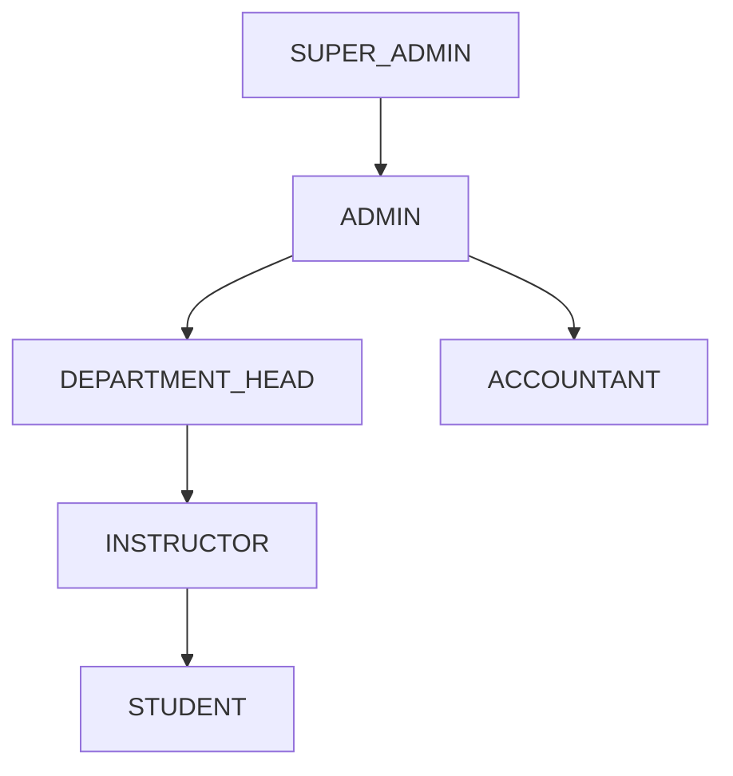

# University Management System — Role Structure & RBAC Design

আমি একটি **University Management System (UMS)** তৈরি করছি। আমার সিস্টেমে নিচের ৬টি primary role থাকবে:

- `SUPER_ADMIN`
- `ADMIN`
- `DEPARTMENT_HEAD`
- `INSTRUCTOR`
- `STUDENT`
- `ACCOUNTANT`

তুমি একজন **Senior Software Architect + University Management System Domain Expert + RBAC Security Specialist** হিসেবে কাজ করবে।

আমার জন্য একটি comprehensive এবং production-ready **`Role_Structure.md`** documentation তৈরি করো।

## 1. Role Hierarchy

প্রথমে এই ৬টি role-এর একটি logical **Role Hierarchy** নির্ধারণ করো।

Hierarchy নির্ধারণ করার সময় বিবেচনা করো:

- কে কাকে manage করতে পারবে
- কে কার data দেখতে পারবে
- কে কোন administrative decision নিতে পারবে
- কোন role কোন role-এর permission override করতে পারবে
- কোন role-এর scope পুরো university, department, course অথবা নিজের account পর্যন্ত সীমাবদ্ধ হবে

একটি clear hierarchy diagram তৈরি করো।

উদাহরণ:

```text
SUPER_ADMIN
    │
    └── ADMIN
          ├── DEPARTMENT_HEAD
          │      └── INSTRUCTOR
          │             └── STUDENT
          │
          └── ACCOUNTANT
```

তবে প্রয়োজন হলে এই hierarchy পরিবর্তন করে আরও বাস্তবসম্মত architecture তৈরি করো এবং কেন পরিবর্তন করেছো তা explain করো।

---

# 2. Role-by-Role Analysis

প্রতিটি role-এর জন্য নিচের বিষয়গুলো বিস্তারিতভাবে define করো:

### Purpose
Roleটির মূল উদ্দেশ্য কী?

### Scope
Roleটি কোন level পর্যন্ত access পাবে?

Possible scope:

- Global / University-wide
- Administrative
- Department-level
- Course-level
- Financial
- Personal / Self-service

### Responsibilities
Roleটির primary responsibilities কী কী?

### Permissions
Roleটি system-এর কোন কোন resource/action access করতে পারবে?

যেমন:

- Create
- Read
- Update
- Delete
- Approve
- Reject
- Manage
- Assign
- Publish
- Suspend
- Restore
- Export
- View Reports

### Restrictions
Roleটি কী কী করতে পারবে না?

Security এবং separation of duties-এর বিষয়গুলো বিশেষভাবে বিবেচনা করো।

---

# 3. Detailed Permission Matrix

একটি comprehensive permission matrix তৈরি করো।

নিচের resources/actions বিবেচনা করো:

- Users
- Students
- Instructors
- Departments
- Courses
- Subjects
- Programs
- Academic Sessions
- Semesters
- Class Schedules
- Enrollments
- Attendance
- Assignments
- Exams
- Results
- Grades
- Notices
- Events
- Payments
- Invoices
- Scholarships
- Financial Reports
- System Settings
- Audit Logs

প্রতিটি resource-এর জন্য ৬টি role-এর permission দেখাও।

Example:

| Resource | SUPER_ADMIN | ADMIN | DEPARTMENT_HEAD | INSTRUCTOR | STUDENT | ACCOUNTANT |
|---|---|---|---|---|---|---|
| Users | Full | Manage | Limited | Own | Own | View |
| Courses | Full | Manage | Department | Assigned | View | View |
| Payments | Full | View | View | — | Own | Manage |

প্রয়োজনে আরও resources যোগ করো।

---

# 4. CRUD + Action Permissions

শুধু `CRUD` দিয়ে permission define করো না।

প্রয়োজন অনুযায়ী granular actions ব্যবহার করো:

- `CREATE`
- `READ`
- `UPDATE`
- `DELETE`
- `APPROVE`
- `REJECT`
- `ASSIGN`
- `PUBLISH`
- `ARCHIVE`
- `SUSPEND`
- `RESTORE`
- `EXPORT`
- `GENERATE_REPORT`

প্রতিটি role-এর জন্য কোন action allowed এবং কোনটি restricted তা clearly define করো।

---

# 5. Role-Specific Responsibilities

প্রতিটি role-এর জন্য practical responsibilities দাও।

বিশেষভাবে explain করো:

## SUPER_ADMIN
- System-wide control
- Admin management
- Global configuration
- Security
- Audit
- Role management

## ADMIN
- University operational management
- User management
- Academic management
- Department coordination
- General administration

## DEPARTMENT_HEAD
- Department management
- Instructor management
- Course/subject coordination
- Department academic oversight
- Department-level reporting

## INSTRUCTOR
- Assigned courses
- Attendance
- Assignments
- Exams
- Grades/results
- Student academic interaction

## STUDENT
- Profile
- Course enrollment
- Class schedule
- Attendance viewing
- Assignment submission
- Exam/result viewing
- Payment/invoice viewing

## ACCOUNTANT
- Student payments
- Invoices
- Financial records
- Payment verification
- Financial reports
- Scholarship/payment-related operations

উপরের list-কে expand করে একটি realistic University Management System-এর জন্য যথাযথ responsibilities নির্ধারণ করো।

---

# 6. Restrictions & Security Rules

প্রতিটি role-এর জন্য explicit restrictions define করো।

বিশেষভাবে **Principle of Least Privilege** এবং **Separation of Duties** অনুসরণ করো।

উদাহরণ:

- `INSTRUCTOR` অন্য instructor-এর course manage করতে পারবে না
- `STUDENT` অন্য student's private data দেখতে পারবে না
- `DEPARTMENT_HEAD` অন্য department-এর data modify করতে পারবে না
- `ACCOUNTANT` academic grades modify করতে পারবে না
- `ADMIN` `SUPER_ADMIN` account বা critical system configuration modify করতে পারবে না
- `SUPER_ADMIN` ছাড়া sensitive system-level role পরিবর্তন করা যাবে না

প্রয়োজন অনুযায়ী আরও security restrictions যোগ করো।

---

# 7. Data Access Scope

Role-based access-এর পাশাপাশি **data scope** define করো।

উদাহরণ:

```text
SUPER_ADMIN → Entire University
ADMIN → Entire University (Administrative Scope)
DEPARTMENT_HEAD → Own Department
INSTRUCTOR → Assigned Courses / Students
STUDENT → Own Data
ACCOUNTANT → Financial Data
```

প্রতিটি role-এর জন্য:

- Read scope
- Write scope
- Update scope
- Delete scope

ব্যাখ্যা করো।

---

# 8. User Flow

প্রয়োজন অনুযায়ী গুরুত্বপূর্ণ user flows তৈরি করো।

কমপক্ষে নিচের flowগুলো consider করো:

### Authentication Flow

```text
Login
  ↓
Identify User
  ↓
Validate Credentials
  ↓
Check Role
  ↓
Load Permissions
  ↓
Role-based Dashboard
```

### Student Enrollment Flow

```text
STUDENT
   ↓
Select Course
   ↓
Submit Enrollment
   ↓
Department/Admin Review
   ↓
Approve
   ↓
Enrollment Confirmed
```

### Instructor Result Submission Flow

```text
INSTRUCTOR
   ↓
Select Assigned Course
   ↓
Enter Grades
   ↓
Submit Result
   ↓
Department Head Review
   ↓
Approve / Reject
   ↓
Publish Result
   ↓
STUDENT
```

### Payment Flow

```text
STUDENT
   ↓
Generate/View Invoice
   ↓
Make Payment
   ↓
ACCOUNTANT
   ↓
Verify Payment
   ↓
Payment Confirmed
   ↓
Financial Record Updated
```

প্রয়োজনে আরও গুরুত্বপূর্ণ flow যোগ করো।

---

# 9. Visual Diagrams

যেখানে প্রয়োজন সেখানে **Mermaid diagrams** ব্যবহার করো যাতে Markdown file-এর ভিতরেই visual representation থাকে।

কমপক্ষে:

1. Role Hierarchy Diagram
2. Permission/Access Relationship Diagram
3. Authentication & Authorization Flow
4. Student Enrollment Flow
5. Result Submission & Approval Flow
6. Payment Flow

Mermaid syntax ব্যবহার করো:



Diagramগুলো logically accurate এবং সহজে বোঝা যায় এমন হওয়া উচিত।

---

# 10. RBAC Architecture Recommendation

শেষে আমার University Management System-এর জন্য একটি recommended **RBAC architecture** দাও।

Explain করো:

- Role-based authorization কীভাবে implement করা উচিত
- Role এবং Permission আলাদা entity হওয়া উচিত কিনা
- Permission naming convention কী হতে পারে
- Resource + Action based permission structure
- Role → Permissions relationship
- User → Role relationship
- Department-level access কীভাবে enforce করা যায়
- Course-level access কীভাবে enforce করা যায়
- Middleware/guard কোথায় ব্যবহার করা উচিত
- Backend authorization এবং frontend UI permission-এর পার্থক্য

একটি recommended structure দেখাও:

```text
User
  ↓
Role
  ↓
Permissions
  ↓
Resource + Action
```

---

# 11. Database/RBAC Model Recommendation

প্রয়োজনে একটি conceptual database structure suggest করো:

```text
User
Role
Permission
RolePermission
UserRole
Department
```

প্রয়োজনে additional entities যেমন:

```text
Course
CourseInstructor
StudentEnrollment
```

ব্যবহার করে scope-based authorization কীভাবে করা যায় তা explain করো।

Prisma ORM ব্যবহার করলে কীভাবে model করা যেতে পারে তার conceptual example দিতে পারো।

---

# 12. API Authorization Examples

কিছু realistic API example দাও।

যেমন:

```text
GET    /api/students
POST   /api/students
PATCH  /api/students/:id
DELETE /api/students/:id
```

এবং explain করো কোন role কোন endpoint access করতে পারবে।

Example:

```text
GET /api/students
SUPER_ADMIN       → ALLOW
ADMIN             → ALLOW
DEPARTMENT_HEAD   → DEPARTMENT-SCOPED
INSTRUCTOR        → ASSIGNED-STUDENT-SCOPED
STUDENT           → OWN PROFILE ONLY
ACCOUNTANT        → LIMITED / FINANCIAL CONTEXT
```

---

# 13. Final Recommended Structure

শেষে একটি concise summary দাও:

### Role Hierarchy

### Role Scope

### Permission Strategy

### Security Rules

### Data Access Strategy

### Recommended RBAC Architecture

### Important Implementation Notes

---

# Important Requirements

- Documentation অবশ্যই **production-oriented** হতে হবে।
- শুধু generic CRUD permission দেবে না; realistic university workflow বিবেচনা করবে।
- **Least Privilege** অনুসরণ করবে।
- **Separation of Duties** অনুসরণ করবে।
- Academic এবং Financial responsibilities আলাদা রাখবে।
- Department-level এবং course-level data isolation বিবেচনা করবে।
- Sensitive student data-এর জন্য privacy/access restrictions রাখবে।
- Frontend permission hiding-কে security হিসেবে consider করবে না; backend authorization অবশ্যই enforce করতে হবে।
- যেখানে ambiguity আছে সেখানে reasonable assumption করে তা clearly mention করবে।
- Overlapping responsibilities কমিয়ে clear accountability তৈরি করবে।
- Role hierarchy এবং permissions এমনভাবে design করবে যাতে ভবিষ্যতে নতুন role/permission সহজে add করা যায়।

## Output

সম্পূর্ণ documentation-টি একটি single Markdown file হিসেবে তৈরি করো:

```text
Role_Structure.md
```

এটি এমনভাবে লিখবে যেন একজন developer সরাসরি এই documentation ব্যবহার করে **database schema, backend authorization, middleware, API permissions এবং frontend role-based UI** design করতে পারে।